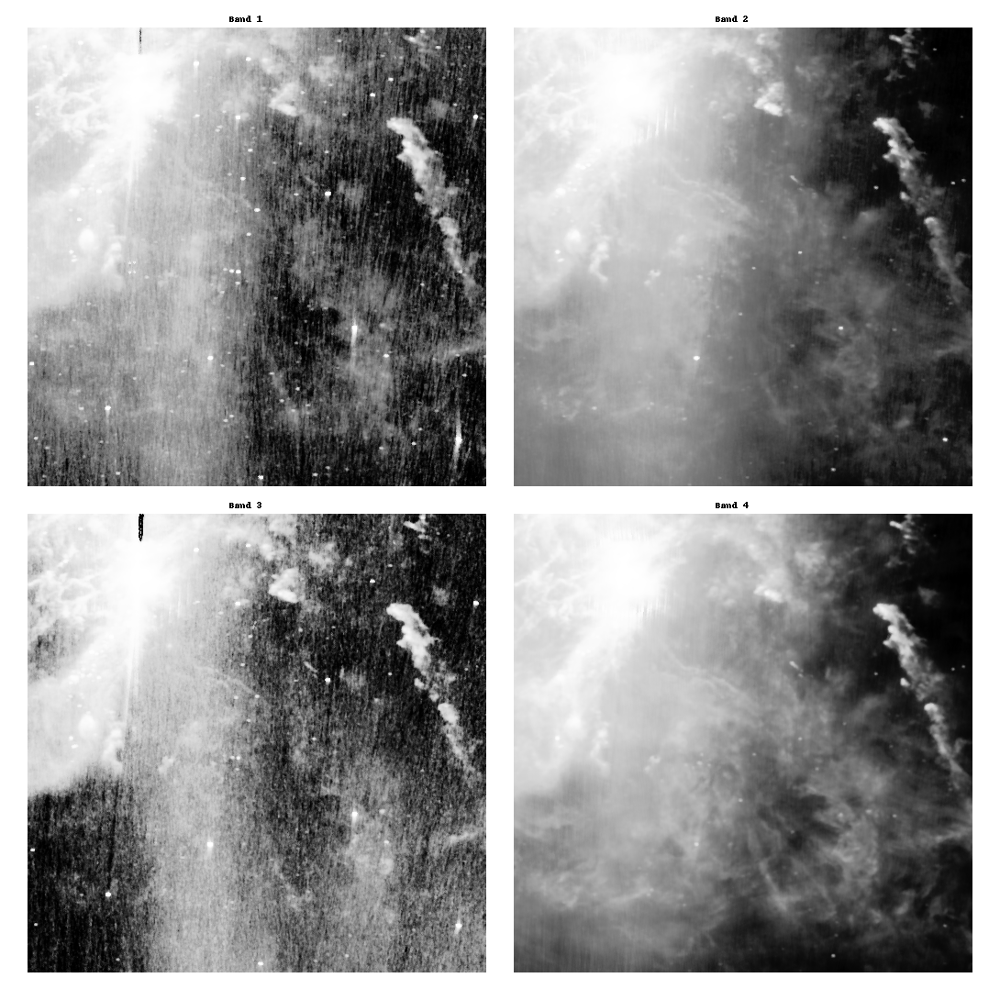

# equalizeorion
Given raw data of a 500*500 image (of orion), separated by bands, as a list of strings in 4 text files, the program parses it, equalizes the 4 bands, outputs them and then combines the different channels into a single RGB image and outputs that.

Input:
The res folder contains four .txt files (i170b1h0_t0.txt, i170b2h0_t0.txt, i170b3h0_t0.txt, i170b4h0_t0.txt), each containing information of the same region in space but with different settings in wavelength (12, 25, 60 and 100 µm). The stored values signify emission measurements from the emitting material in space (e.g. stars). They are stored as ASCII values, each value as a double value with exponent. Each value is set in quotation marks (") and values are separated with commas (,) (e.g. "1.1848001634E+000","1.2553906147E+000"). Each file contains values for a 500x500 image (therefore 500x500 values). The values are stored by row from the right border of the image to the left. Therefore, the first value in a file is the value with coordinates (500, 1), the second with coordinates (500, 2), to (500, 500) and then (499, 1) and so on.
The files are taken from http://irsa.ipac.caltech.edu/data/ISSA/ with
Target Selection: Single Object "orion"
Size: 12.5
The data set is the one with distance 334.3440, RA 80.5922470 and Dec -9.9530725

Output:
The out folder contains the processed images.
"equalized.png" is a combined image of the equalized and linear transformed band data. 
"rgborion.png" is a combination of 3 band datas as red, green and blue channels.

##### &nbsp;&nbsp;&nbsp;&nbsp;&nbsp;&nbsp;Equalized Bands :&nbsp;&nbsp;&nbsp;&nbsp;&nbsp;&nbsp;&nbsp;&nbsp;&nbsp;&nbsp;&nbsp;&nbsp;&nbsp;&nbsp;&nbsp;&nbsp;&nbsp;&nbsp;&nbsp;&nbsp;&nbsp;&nbsp;&nbsp;&nbsp;&nbsp;&nbsp;&nbsp;&nbsp;&nbsp;&nbsp;&nbsp;&nbsp;&nbsp;&nbsp;&nbsp;&nbsp;&nbsp;&nbsp;&nbsp;&nbsp;&nbsp;&nbsp;&nbsp;&nbsp;&nbsp;&nbsp;&nbsp;&nbsp;&nbsp;&nbsp;&nbsp;&nbsp;&nbsp;&nbsp;&nbsp;&nbsp;&nbsp;&nbsp;&nbsp;&nbsp;&nbsp;&nbsp;&nbsp;&nbsp;&nbsp;&nbsp;&nbsp;&nbsp;&nbsp;&nbsp;&nbsp;&nbsp;&nbsp;&nbsp;&nbsp;&nbsp;&nbsp;&nbsp;&nbsp;&nbsp;&nbsp;&nbsp;&nbsp;&nbsp;&nbsp;Equalized Bands combined into a RGB image :

